> [Revenir à l'accueil](../README.md)

# Les commandes version VS Code

Ici vous aurez un guide sur les boutons de VS Code qui remplace les commandes **_git_**.
Penser à bien vous mettre dans l'onglet **_GitHub_** de **_VS Code_**.

## Sommaire

- [Récupérer les dernières modifications de la branche actuelle](#Récupérer-les-dernières-modifications-de-la-branche-actuelle)

- [Envoyer vos modifications et ajouts au dépot GitHub](#Envoyer-vos-modifications-et-ajouts-au-dépot-GitHub)

- [Créer une branche](#Créer-une-branche)

- [Changer de branche](#Changer-de-branche)

- [Fusionner les branches](Fusionner-les-branches)

## Récupérer les dernières modifications de la branche actuelle

- Pour récupérer les dernières modifications de votre branche actuelle, il suffit de cliquer sur **_..._** à côté de **_Modifications_**, puis de cliquer sur **_Tirer (Pull)_**.

> Cela correspond à la commande : `git pull`.

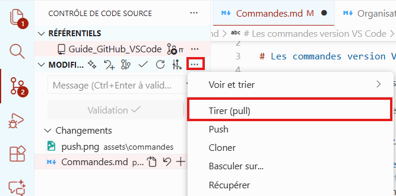

## Envoyer vos modifications et ajouts au dépot GitHub

- Pour ajouter des éléments au **_commit_** il suffit de cliquer sur le bouton **_+_** qui apparait à côté de vos fichiers ou de cliquer sur le **_+_** à coté de changement.

> Cela correspond aux commandes : `git add .` (ajoute tout) ou `git add [le_fichier]` (ajoute un élément particulier).

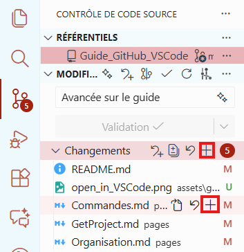

- Ensuite, vous devrez renseigner un message de commit et cliquer sur **_validation_**.

> Cela correspond à la commande : `git commit -m "[le message]"`.

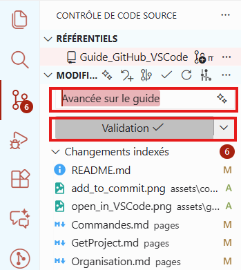

- Enfin, il ne manque plus qu'à envoyer votre commit au dépot GitHub en cliquant sur bouton d'envoie.

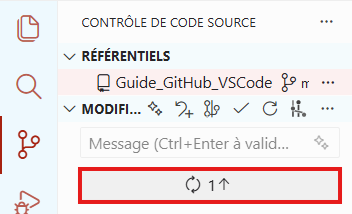

## Créer une branche

- Pour créer une branche, il suffit de cliquer sur **_..._** à côté de **_Modifications_**, puis d'aller sur **_branche_** et enfin cliquer sur **_Créer une branche_**.

> Cela correpond à la commande : `git branch [nom_de_la_branche]`.

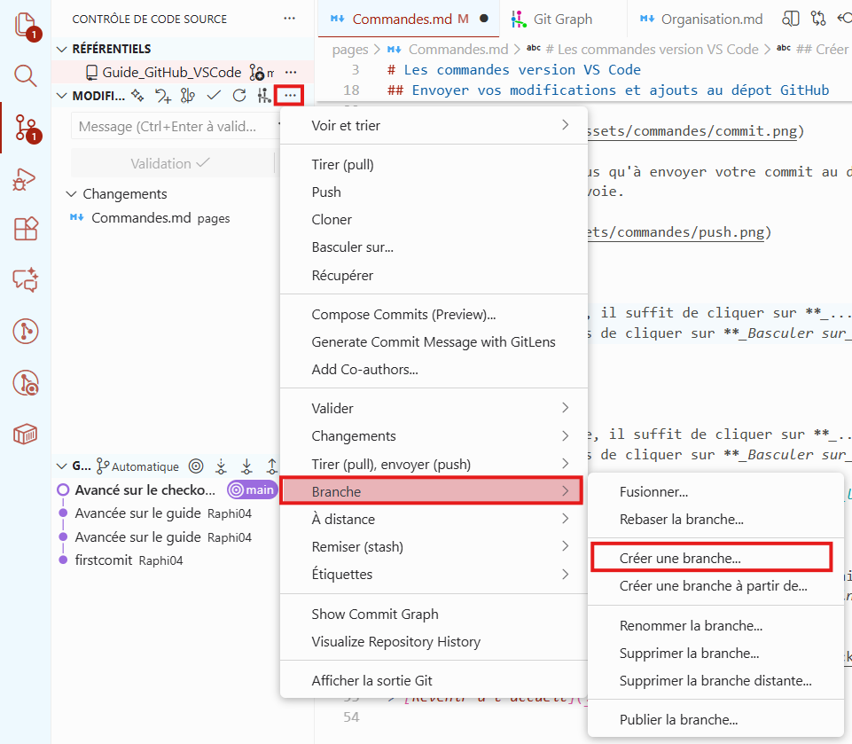

- Ensuite, nommez là.

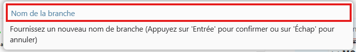

- Enfin, envoyez-là au dépot GitHub en cliquant sur **_Publier Branch_**.

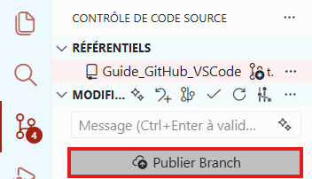

## Changer de branche

- Pour changer de branche, il suffit de cliquer sur **_..._** à côté de **_Modifications_**, puis de cliquer sur **_Basculer sur_**.

> Cela correspond à la commande : `git checkout [nom_de_la_branche]`.

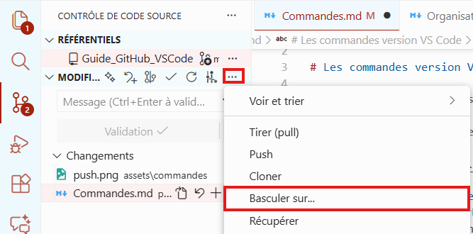

- Sélectioner ensuite la branche sur laquelle vous souhaitez aller (de préférence les branches distantes marqué par un **_Origin_**, pour éviter des problèmes).

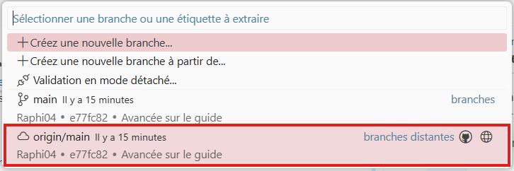

## Fusionner les branches

> Pour fusionner les branches, vous devez tout d'abords vous déplacer sur la branche de destination, celle qui recevra les données.

> Voyez ça comme si la branche de destination tirait vers elle les données de la branche de départ.

- Pour créer une branche, il suffit de cliquer sur **_..._** à côté de **_Modifications_**, puis d'aller sur **_branche_** et enfin cliquer sur **_Fusionner_**.

> Cela correspond à la commande : `git merge [nom_de_la_branche]`

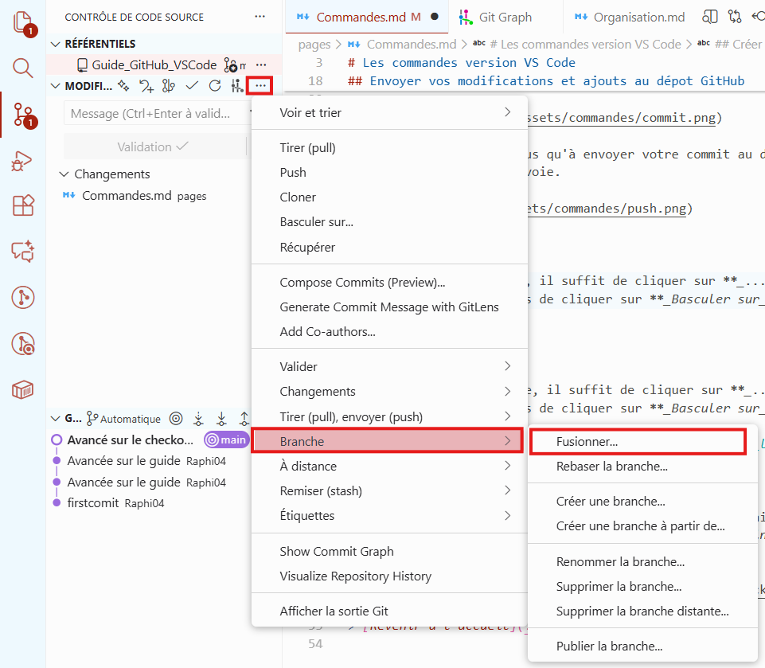

- Séléctionner la branche dont vous souhaitez récupérer les informations (de préférence les branches distantes marqué par un **_Origin_**, pour éviter des problèmes).

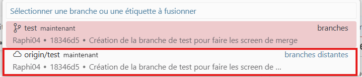

- Enfin, synchroniser la fusion avec le dépôt GitHub.

> [Revenir à l'accueil](../README.md)
