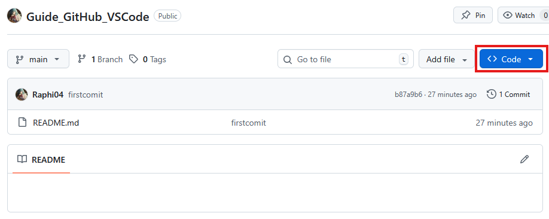
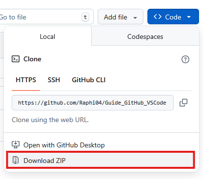
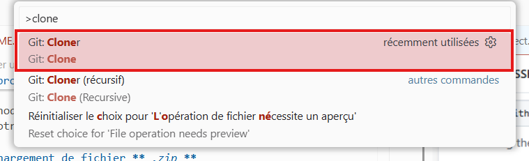

# Récupérer un projet GitHub sur son PC

Nous verrons deux méthodes de récupération de projet GitHub.

La première ne permet que de télécharger un fichier **_.zip_** sans pouvoir contibuer au projet derrière (si on est un contributeur).

La deuxième méthode résout ce problème en initialisant un dépot **_git_** sur votre PC.

## Via un téléchargement de fichier **_.zip_**

- La première étape est de cliqué sur le bouton **_code_** sur la page d'accueil d'un projet GitHub.

- Ensuite cliquer sur **_Download Zip_**

## Via un clone du dépot GitHub (VS Code)

- La première étape est de cliqué sur **_la barre de commande de VS Code_**

- Ensuite il faudra écrire `>clone` et sélectionner **_Git : Clone_**

- Puis, cloner à partir de GitHub

- Ensuite saisissez l'adresse du GitHub que vous souhaitez copier, par exemple : `https://github.com/Raphi04/Guide_GitHub_VSCode`.

- Enfin, choisissez là où vous souhaitez placer le dossier contenant le projet et ouvrez le dans **_VS Code_**.
