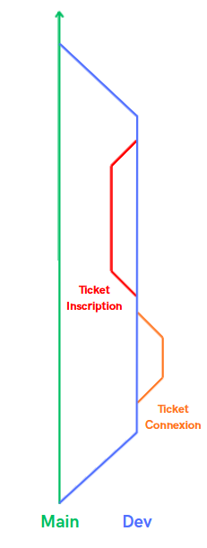

# Organisation des branches de travail

Il existe énormément de méthode de travail en ce qui concerne les branches GitHub, nous allons ici en voir une simple qui peux s'appliquer a de petits projets.

## Explication d'une méthode basique

> **Main** : C'est la branche principal du projet, celle qui contient les avancés dont on est sur qu'elle sont correct.

> **Dev** : C'est la branche secondaire du projet, c'est ici qu'on test des fonctionnalités avant de les passer dans le main.

> **Les tickets** : Ce sont des avancées de la branche dev, en général ils correspondent à des fonctionnalités à réaliser.

Concrètement à chaque fonctionnalité on va créer une nouvelle branche dans **_Dev_**.  
Quand on est satisfait, on fusionne **_Dev_** avec **_Main_**.
